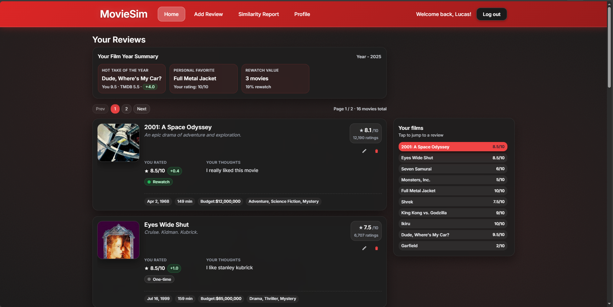
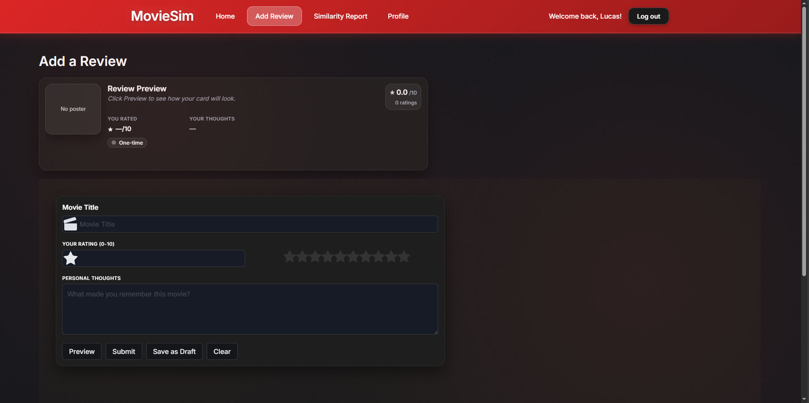
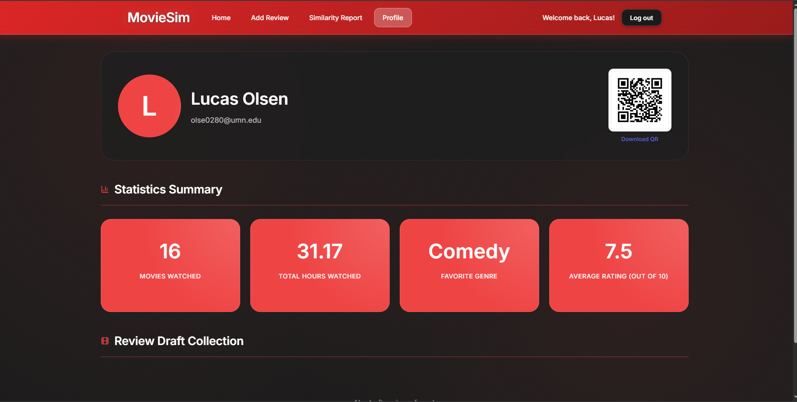
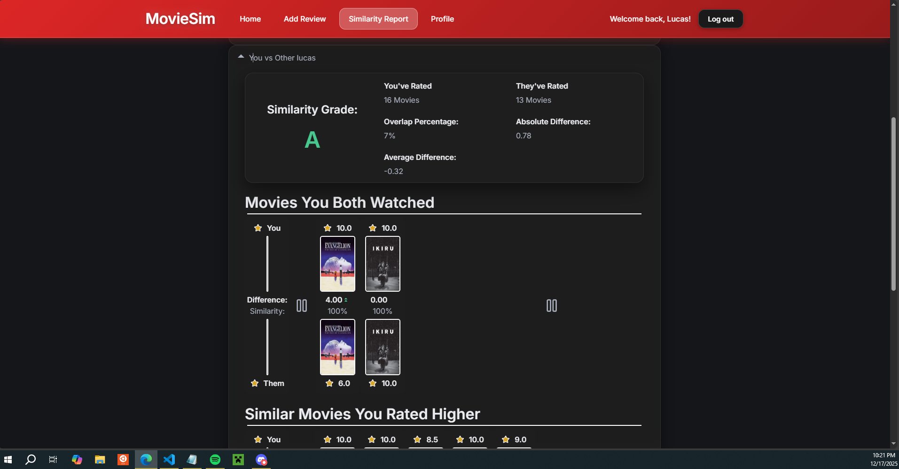

# Module 2 Group Assignment

CSCI 5117, Fall 2025, [assignment description](https://canvas.umn.edu/courses/518559/pages/project-2)

## App Info:

* Team Name: The 503+402
* App Name: MovieSim
* App Link: https://p2-502-402.firebaseapp.com/

### Students

* Lucas Olsen, olse0280@umn.edu
* Hanan Abdirahman, abdir074@umn.edu
* Nitish Kumar, yarla021@umn.edu
* Ritvik Kosuri, kosur005@umn.edu

## Key Features

**Describe the most challenging features you implemented
(one sentence per bullet, maximum 4 bullets):**

* Similarity report - the backend behind the report (generating similarities) was hard to figure out and didn't come out the best.

Which (if any) device integration(s) does your app support?

* Camera - QR code scanning
* Donwload - download QR code

Which (if any) progressive web app feature(s) does your app support?

* Camera - QR code scanning

## Mockup images

### Home Page

The home page of our mobile app displays the current logged-in user’s entries in a scrollable card view. Each movie entry includes the title, metadata (such as genre, rating, and release date), and a text entry containing the user’s thoughts about the movie. Three buttons at the bottom of the page allow navigation to the main sections of the app.
### Create Review

This is our “Create Review” page, where users can add a new film by filling out a form with the film’s title and rating. After entering the title, they have the option to autofill the film’s metadata using an API (planning to use TMDB). Once the metadata is populated, the user only needs to enter their thoughts about the film and their rating.
### Scan Profile

This is the page where a user can generate a compatibility report. It features an in-app camera used to scan a QR code containing another user’s data, which is required to create the compatibility report. Once scanning is complete, the page will refresh with the computed report.  Our original pitch involved sharing data over NFC, but according to mozilla compatability reports, NFC is available on few devices; thus, we pivoted to a more universal solution.
### Compatibility Report

This page is displayed after a user successfully scans a QR code and a compatibility score is generated. It shows the compatibility score along with the information used to calculate it. The page is divided into two sections: Conflicting Views, which lists movies where both users gave vastly different ratings (for example, one rated it 5/5 while the other rated it 1/5), and Similar Views, which highlights movies where the users shared similar opinions.

### 'Profile' page

The 'profile' page of our app is not really a profile in the traditional sense.  This page will merely show your linked google account, a quick statistical summary of interesting datapoints to be used in similarity reports (think favorite genere, average rating ...), and a list of all draft posts a user has not completed yet.

## Testing Notes

**Is there anything special we need to know in order to effectively test your app? (optional):**

* When a report is generated for one user, it is automatically generated and displayed on the other user's device under 'reports'

## Screenshots of Site (complete)

**[Add a screenshot of each key page](https://stackoverflow.com/questions/10189356/how-to-add-screenshot-to-readmes-in-github-repository)
along with a very brief caption:**

You must login first to use our website

The home page displays all movie reviews, along with functionality to edit and delete exisitng reviews

Submit new movie entries to the database

Look at stats for your profile and get your QR code for report generation

Generate a report with a friend using an uploaded or scanned QR code - see what you agree and differ on

## External Dependencies

**Document integrations with 3rd Party code or services here.
Please do not document required libraries (e.g., VUE, Firebase, vuefire).**

* TMDB - the movie database supports our movie data collection
* ...

**If there's anything else you would like to disclose about how your project
relied on external code, expertise, or anything else, please disclose that
here:**

...
